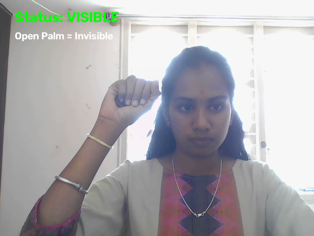
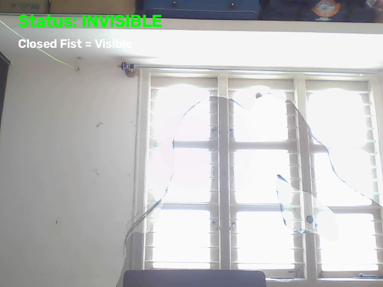

# 🫥 Invisibility Mode

A real-time computer vision project that creates an "invisibility" effect using human segmentation and gesture recognition.

The application captures an empty background using a webcam, detects the person in real time, and replaces the detected person with the previously captured background. The invisibility effect is controlled using hand gestures.

---

## ✨ Features

- Real-time webcam processing
- Human/person segmentation
- Background capture
- Gesture-controlled invisibility
- ✋ Open Palm → Activate Invisibility Mode
- ✊ Closed Fist → Return to Visible Mode
- Real-time status display
- Interactive computer vision experience

---

## 🛠️ Tech Stack

- Python
- OpenCV
- MediaPipe
- NumPy

### Computer Vision Concepts Used

- Human segmentation
- Gesture recognition
- Background replacement
- Real-time image processing
- Webcam video processing

---

## 🧠 How It Works

The project combines human segmentation and gesture recognition to create a real-time invisibility effect.

### Step-by-step process

1. The webcam is opened using OpenCV.
2. The user leaves the camera frame.
3. The application captures the empty background.
4. The user enters the camera frame.
5. MediaPipe detects the person and generates a segmentation mask.
6. The segmentation mask identifies the region occupied by the person.
7. The detected person region is replaced with the previously captured background.
8. MediaPipe Gesture Recognizer detects the user's hand gesture.
9. An Open Palm activates the invisibility effect.
10. A Closed Fist returns the user to visible mode.

### Gesture Flow

```text
✋ Open Palm
      ↓
Invisibility Mode ON
      ↓
🫥 Person disappears

✊ Closed Fist
      ↓
Invisibility Mode OFF
      ↓
👤 Person becomes visible
Invisibility-Mode/
│
├── models/
│   ├── pose_landmarker_lite.task
│   └── gesture_recognizer.task
│
├── main.py
├── test_gesture.py
├── requirements.txt
├── .gitignore
└── README.md
git clone YOUR_GITHUB_REPOSITORY_URL
cd Invisibility-Mode
python -m venv venv
venv\Scripts\Activate.ps1
pip install -r requirements.txt
models/
python main.py
Background captured!
Now ENTER the frame.
| Gesture / Key | Action                     |
| ------------- | -------------------------- |
| ✋ Open Palm   | Activate Invisibility Mode |
| ✊ Closed Fist | Return to Visible Mode     |
| Q             | Exit the application       |
---

## 🎥 Demo

A short demonstration video will be added here.

The demonstration will show:

1. Background capture
2. Normal visible mode
3. Open Palm gesture
4. Invisibility effect
5. Closed Fist gesture
6. Returning to visible mode
---

## 📸 Screenshots

### 👤 Visible Mode

The user is normally visible in the webcam feed.



### 🫥 Invisibility Mode

The detected person is replaced by the previously captured background.


---

## 🚀 Future Improvements

- Improve segmentation around hair and body edges
- Reduce mask flickering
- Improve real-time performance
- Improve segmentation quality during movement
- Add additional gesture controls
- Add a graphical user interface
- Add more visual effects
- Support more complex movements and environments
- Improve robustness under different lighting conditions
---

## 📚 What I Learned

Through this project, I explored and learned about:

- Real-time computer vision
- Human/person segmentation
- Gesture recognition
- Background replacement
- Webcam processing using OpenCV
- MediaPipe Tasks
- Real-time image processing
- Working with segmentation masks
- Integrating multiple computer vision components
- Building and testing a complete computer vision application
---

## 👩‍💻 Author

**Haripriya M**

B.Tech Data Science Student